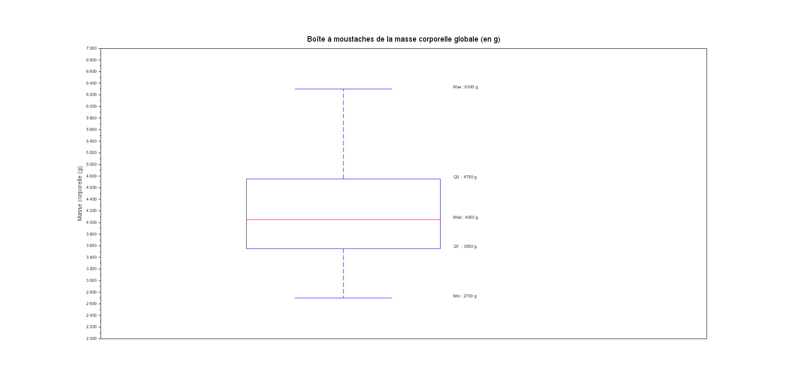
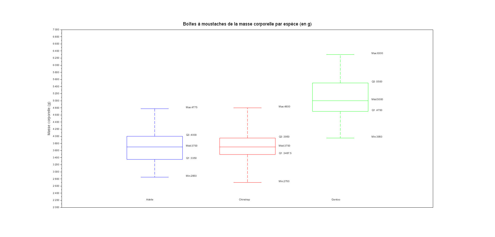
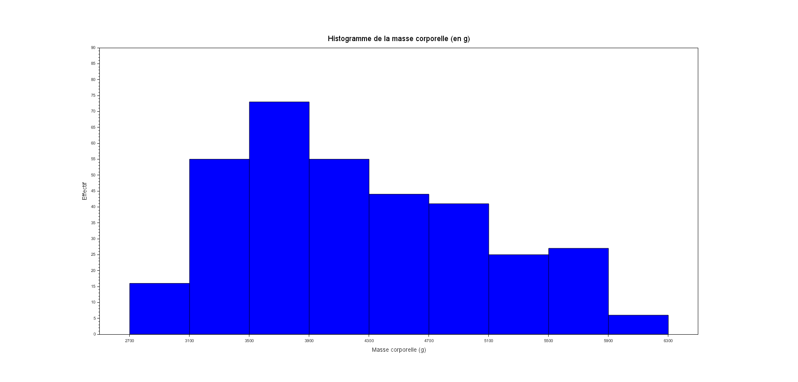
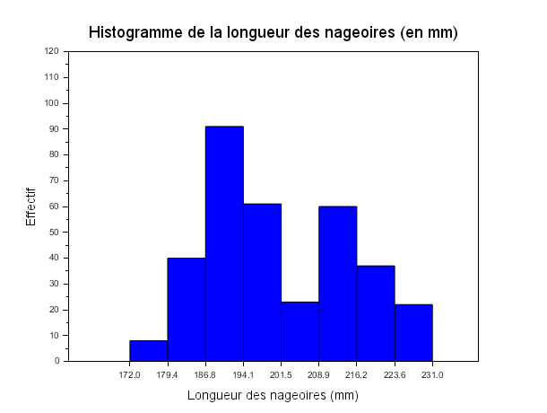
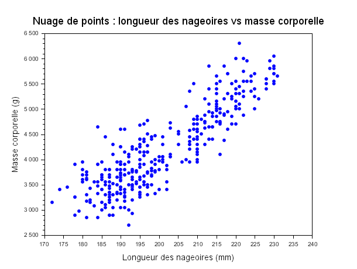
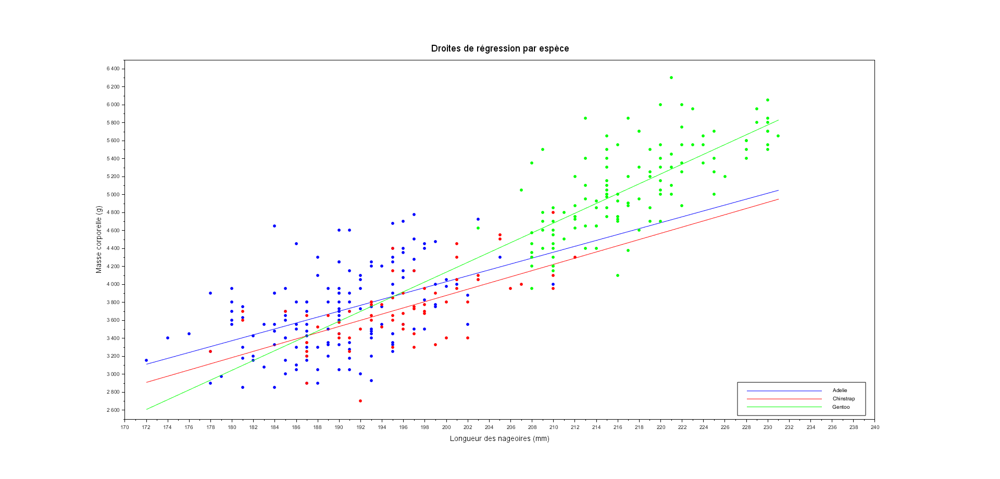

# SAÉ S2.04 — Visualisation de données : manchots de Palmer

# MOUSTAVE Djabrail & OUISSI Mohamed

Ce rapport présente les réponses aux questions du sujet, obtenues à partir du
fichier `data/penguins_size.csv`. Chaque réponse renvoie vers le script Scilab
(dans le dossier `scripts/`) qui permet de la calculer et/ou de l'afficher.

## Q1 — Nombre de manchots *(voir script01)*
---

Le jeu de données contient **344 manchots**.

```
=== QUESTION 1 ===
Le nombre total de manchots est : 344
==================
```

## Q2 — Répartition par espèce *(voir script01)*
---

La répartition est **Adelie : 152, Chinstrap : 68, Gentoo : 124**.
Les Adelie sont l'espèce la plus représentée, les Chinstrap la moins représentée.

```
=== QUESTION 2 ===
Répartition des individus par espèce :
  - Adelie    : 152
  - Chinstrap : 68
  - Gentoo    : 124
==================
```

## Q3 — Répartition par sexe *(voir script01)*
---

La répartition est **Mâles : 168, Femelles : 165, Inconnus : 11**.
Les sexes sont quasiment équilibrés, avec 11 individus dont le sexe est inconnu.

```
=== QUESTION 3 ===
Répartition des individus par sexe :
  - Mâles    : 168
  - Femelles : 165
  - Inconnus : 11
==================
```

## Q4 — Masse moyenne *(voir script02)*
---

Masse corporelle moyenne (tous individus confondus) : **4201,75 g**.

```
=== QUESTION 4 ===
La masse moyenne des manchots est : 4201.75 grammes
==================
```

## Q5 — Moyenne, médiane, écart-type de la masse *(voir script02)*
---

```
=== QUESTION 5 ===
Statistiques sur la masse corporelle :
  - Moyenne    : 4201.75 grammes
  - Médiane    : 4050.00 grammes
  - Écart-type : 801.95 grammes
==================
```

La moyenne est légèrement supérieure à la médiane : la distribution est
modérément étalée vers les masses élevées (asymétrie positive), notamment du
fait du groupe Gentoo, plus lourd.

## Q6 — Masse moyenne par espèce *(voir script02)*
---

```
=== QUESTION 6 ===
Masse moyenne par espèce :
  - Adelie    : 3700.66 grammes
  - Chinstrap : 3733.09 grammes
  - Gentoo    : 5076.02 grammes
==================
```

Le Gentoo est nettement plus lourd que les deux autres espèces (environ
1350 g de plus en moyenne). Adelie et Chinstrap ont des masses moyennes très
proches.

## Q7 — Espèce avec la plus forte variabilité de masse *(voir script02)*
---

```
=== QUESTION 7 ===
Variabilité par espèce (Écart-type | Coef. Variation) :
  - Adelie    : 458.57 g  |  CV : 12.39%
  - Chinstrap : 384.34 g  |  CV : 10.30%
  - Gentoo    : 504.12 g  |  CV :  9.93%
==================
```

En valeur absolue, c'est le **Gentoo** qui présente le plus grand écart-type
(504 g). Mais relativement à sa propre moyenne (coefficient de variation),
c'est l'**Adelie** qui est la plus dispersée (12,39 % contre 9,93 % pour le
Gentoo) : ses individus varient proportionnellement plus en masse.

## Q8 — Quartiles de la masse corporelle *(voir script02)*
---

La moitié centrale des manchots pèse entre **3550 g** et **4750 g**.
La médiane à **4050 g** sépare la population en deux parts égales.

```
=== QUESTION 8 ===
Quartiles de la masse corporelle globale :
  - Q1 (25%) : 3550.00 grammes
  - Q2 (50%) : 4050.00 grammes
  - Q3 (75%) : 4750.00 grammes
==================
```

## Q9 — Écart interquartile *(voir script02)*
---

IQR = Q3 − Q1 = 4750 − 3550 = **1200 g**.
Cette dispersion importante s'explique par la cohabitation d'espèces de
gabarits très différents dans le même fichier.

```
=== QUESTION 9 ===
L'écart interquartile (IQR) est de : 1200.00 grammes
==================
```

## Q10 — Boîte à moustaches de la masse corporelle *(voir script03)*
---



```
=== QUESTION 10 ===
-----------------------------
| Indicateur | Valeur (g)   |
-----------------------------
| Minimum    |      2700.00 |
| Q1 (25%)   |      3550.00 |
| Médiane    |      4050.00 |
| Q3 (75%)   |      4750.00 |
| Maximum    |      6300.00 |
-----------------------------
====================
```

La **médiane** se situe à 4050 g. La boîte centrale montre que 50 % des
individus pèsent entre 3550 g et 4750 g. La moustache supérieure plus longue
met en évidence une **asymétrie positive**, expliquée par la présence des
Gentoo nettement plus lourds.

## Q11 — Comparaison des boîtes à moustaches par espèce *(voir script03)*
---



```
=== QUESTION 11 ===
--------------------------------------------------
| Indicateur | Adelie   | Chinstrap | Gentoo    |
--------------------------------------------------
| Minimum    |     2850 |      2700 |    3950   |
| Q1 (25%)   |     3350 |      3488 |    4700   |
| Médiane    |     3700 |      3700 |    5000   |
| Q3 (75%)   |     4000 |      3950 |    5500   |
| Maximum    |     4775 |      4800 |    6300   |
--------------------------------------------------
====================
```

Les boîtes des **Adelie** et **Chinstrap** se chevauchent fortement et sont
situées presque au même niveau, indiquant des masses corporelles très similaires.
En revanche, la boîte des **Gentoo** est nettement décalée vers le haut, sans
aucun chevauchement avec les deux autres espèces.

## Q12 — Histogramme de la masse corporelle *(voir script04)*
---



```
=== QUESTION 12 ===
Histogramme de la masse corporelle
Min reel = 2700 g | Max reel = 6300 g
Classes de 400g, de 2700 a 6300 - Figure 2 affichee
====================
```

L'histogramme montre une **distribution asymétrique positive** (avec une tendance bimodale) dont la classe modale est **[3500-3900 g]** contenant 73 manchots (21,3 %). On repère aisément le regroupement des espèces plus légères (Adelie/Chinstrap) sous la barre des 4500 g, et l'étalement des manchots Gentoo vers les poids les plus élevés (jusqu'à 6300 g).

## Q13 — Classe modale et fréquences *(voir script04)*
---

La classe modale est **[3500-3900 g]** avec un effectif de **73 manchots**, représentant **21,3 %** de la population.

```
=== QUESTION 13 ===
---------------------------------------------------------
| Classe (g)      | Effectif | Frequence (%)           |
---------------------------------------------------------
| [2700 - 3100[  |    16    |      4.7 %
| [3100 - 3500[  |    55    |     16.1 %
| [3500 - 3900[  |    73    |     21.3 %
| [3900 - 4300[  |    55    |     16.1 %
| [4300 - 4700[  |    44    |     12.9 %
| [4700 - 5100[  |    41    |     12.0 %
| [5100 - 5500[  |    25    |      7.3 %
| [5500 - 5900[  |    27    |      7.9 %
| [5900 - 6300[  |     6    |      1.8 %
---------------------------------------------------------
Classe MODALE : [3500 - 3900[ avec effectif  73
---------------------------------------------------------
====================
```

## Q14 — Histogramme de la longueur des nageoires *(voir script04)*
---



```
=== QUESTION 14 ===
-----------------------------------------------------------
| Classe (mm)      | Effectif | Frequence (%)           |
-----------------------------------------------------------
| [172.0 - 179.4[  |     8    |     2.3 %               |
| [179.4 - 186.8[  |    40    |    11.7 %               |
| [186.8 - 194.1[  |    91    |    26.6 %               |
| [194.1 - 201.5[  |    61    |    17.8 %               |
| [201.5 - 208.9[  |    23    |     6.7 %               |
| [208.9 - 216.2[  |    60    |    17.5 %               |
| [216.2 - 223.6[  |    37    |    10.8 %               |
| [223.6 - 231.0[  |    22    |     6.4 %               |
-----------------------------------------------------------
Total : 342 manchots
====================
```

On observe une distribution avec **deux pics** (autour de 190 mm et 215 mm),
correspondant aux nageoires des Adelie/Chinstrap (plus courtes) et des Gentoo
(plus longues) qui forment deux groupes morphologiquement distincts.

## Q15 — Nuage de points nageoires / masse *(voir script05)*
---



```
=== QUESTION 15 ===
Nuage de points affiché - Figure 4
====================
```

On observe une **relation linéaire positive** entre la longueur des nageoires
et la masse corporelle : plus les nageoires sont longues, plus le manchot est
lourd. Le nuage est légèrement dispersé en raison du mélange des trois espèces.

## Q16 — Coefficient de corrélation Pearson nageoires / masse *(voir script05)*
---

```
=== QUESTION 16 ===
Coefficient de corrélation (nageoires / masse) : 0.8712
====================
```

Le coefficient **r = 0,87** indique une **corrélation linéaire forte et
positive** entre la longueur des nageoires et la masse corporelle.

## Q17 — Corrélation longueur bec / profondeur bec *(voir script05)*
---

```
=== QUESTION 17 ===
Coefficient de corrélation (longueur bec / profondeur bec) : -0.2351
====================
```

Le coefficient **r = −0,24** indique une **corrélation négative faible** :
les deux dimensions du bec ne sont pas liées linéairement de façon
significative sur l'ensemble de la population.

## Q18 — Droite de régression masse / nageoires *(voir script06)*
---

```
=== QUESTION 18 ===
Droite de régression : masse = 49.6856 * nageoires + (-5780.8314)
====================
```

L'équation obtenue est : **masse = 49,69 × nageoires − 5780,83**

Cela signifie qu'en moyenne, chaque millimètre supplémentaire de nageoire
correspond à environ **+50 g** de masse corporelle.

## Q20 — Coefficient de détermination R² *(voir script06)*
---

```
=== QUESTION 20 ===
Coefficient de détermination R² : 0.7590
====================
```

**R² = 0,76** : le modèle linéaire explique environ **76 %** de la variabilité
de la masse corporelle à partir de la longueur des nageoires.

## Q21 — Estimation pour nageoires = 210 mm *(voir script06)*
---

```
=== QUESTION 21 ===
Masse estimée pour nageoires = 210 mm : 4653.14 g
====================
```

D'après le modèle, un manchot dont les nageoires mesurent **210 mm** aurait
une masse estimée d'environ **4653 g**.

## Q22 — Droites de régression par espèce *(voir script06)*
---



```
=== QUESTION 22 ===
-------------------------------------------------------------
| Espèce    |   Pente (a) |  Intercept (b) |    r (Pearson) |
-------------------------------------------------------------
| Adelie    |     32.8317 |     -2535.8368 |         0.4682 |
| Chinstrap |     34.5734 |     -3037.1958 |         0.6416 |
| Gentoo    |     54.6225 |     -6787.2806 |         0.7027 |
-------------------------------------------------------------
====================
```

- Les **Gentoo** occupent une zone à part avec des nageoires plus longues
  (210–235 mm) et une masse nettement plus élevée (4500–6300 g).
- Les **Adelie** et **Chinstrap** se superposent dans la zone 172–210 mm,
  confirmant leur similarité morphologique.
- La **pente est plus forte chez les Gentoo** (54,62 g/mm) que chez les Adelie
  (32,83 g/mm) et Chinstrap (34,57 g/mm).
- Les **coefficients de corrélation restent modérés** au sein de chaque espèce
  (entre 0,47 et 0,70), contrairement à la corrélation globale (0,87) gonflée
  par la séparation naturelle entre espèces.

## Q23 — Comparaison mâles / femelles *(voir script07)*
---

```
=== QUESTION 23 ===
--------------------------------------------------
| Indicateur  |    Mâles    |   Femelles         |
--------------------------------------------------
| Moyenne (g) |     4545.68 |     3862.27        |
| Médiane (g) |     4300.00 |     3650.00        |
| Écart-type  |      787.63 |      666.17        |
--------------------------------------------------
====================
```

Les **mâles sont significativement plus lourds** que les femelles :
leur moyenne est supérieure d'environ **680 g** et leur médiane de **650 g**.
Les mâles présentent également une plus grande variabilité (écart-type de
787 g contre 666 g pour les femelles).

## Q24 — Variable la plus corrélée à la masse *(voir script07)*
---

```
=== QUESTION 24 ===
------------------------------------------
| Variable           | Corrélation avec masse |
------------------------------------------
| Longueur du bec    |                 0.5951 |
| Profondeur du bec  |                -0.4719 |
| Longueur nageoires |                 0.8712 |
------------------------------------------
====================
```

C'est la **longueur des nageoires** qui est la plus fortement corrélée à la
masse corporelle (r = 0,87). La longueur du bec présente une corrélation
modérée positive (r = 0,60), tandis que la profondeur du bec est négativement
corrélée (r = −0,47), ce qui s'explique par le fait que les Gentoo ont un bec
moins profond mais sont nettement plus lourds que les deux autres espèces.